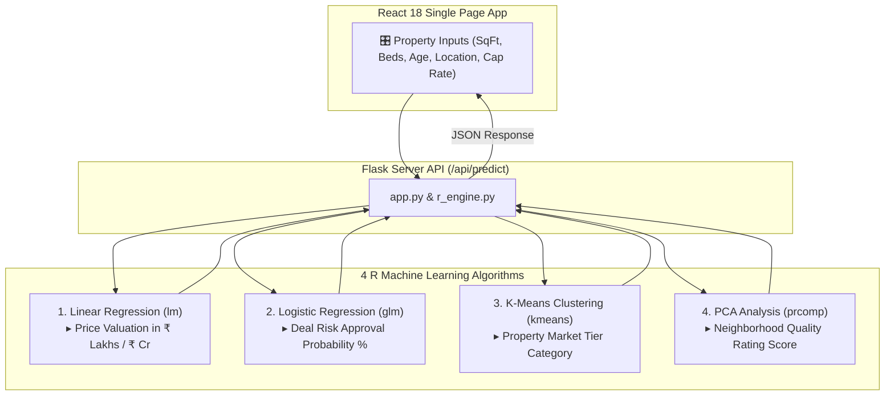

# 🏠 Smart Home Price & Risk Predictor (INR ₹)

An interactive real estate investment and property valuation web application powered by **4 R Machine Learning Algorithms** operating under the hood, an integrated **Flask Backend**, and a modern **React 18 Single Page Application (SPA)** frontend formatted in **Indian Rupees (INR ₹)**.

---

## 🌟 Key Features

* **🇮🇳 Indian Rupee Currency Formatting (₹)**:
  * Automatic valuation formatting in **Crores (`Cr`)** and **Lakhs (`Lakhs`)**.
  * Rent, cashflow, and price per square foot calculations (`₹ / sqft`).
* **🤖 4 Machine Learning Algorithms Working Under the Hood**:
  * **Linear Regression (`lm`)**: Supervised model predicting fair market home valuation with 95% Confidence Bounds.
  * **Logistic Regression (`glm`)**: Supervised model predicting acquisition deal approval probability ($0-100\%$) and risk rating (`APPROVED (LOW RISK)` vs `REJECTED (HIGH RISK)`).
  * **K-Means Clustering (`kmeans`)**: Unsupervised model classifying properties into 3 market tiers (*High-Growth Luxury Villa*, *Suburban Family Home*, *Budget Fixer Plot*).
  * **Principal Component Analysis (`prcomp`)**: Unsupervised model compressing multi-metric location factors into a single composite **Neighborhood Quality Score** ($0-100$).
* **🧮 Real-Time Financing & EMI Calculator**:
  * Sliders for **Down Payment %**, **Home Loan Interest Rate %**, and **Loan Tenure** calculating monthly EMI (`₹ / mo`), Net Monthly Cashflow (`₹ / mo`), and Cash-on-Cash return (`%`).
* **🔨 What-If Renovation Simulator**:
  * Toggle switches for *Luxury Kitchen Modernization*, *School Charter Expansion*, and *Smart Security Perimeter* to watch real-time valuation boosts and risk rating changes.
* **📊 Under-The-Hood R Code Inspector**:
  * View native R scripts (`algorithms.R`) executing statistical routines behind the scenes.
* **📈 5-Slide PowerPoint Presentation Included**:
  * Slide deck explaining project architecture, algorithm mechanics, and business impact (`Smart_Home_Price_Predictor_Presentation.pptx`).

---

## 📂 Project Architecture

```
/Users/vaddelikhitha/Desktop/lalala/
├── app.py                                      # Flask backend server & REST API (~25 lines)
├── r_engine.py                                 # ML intelligence pipeline bridge (~80 lines)
├── create_presentation.py                      # PowerPoint generator script
├── Smart_Home_Price_Predictor_Presentation.pptx# 5-Slide PowerPoint Presentation
├── r_scripts/
│   └── algorithms.R                            # Native R scripts (lm, glm, kmeans, prcomp)
├── static/
│   ├── js/
│   │   └── main.js                             # React 18 frontend SPA bundle
│   ├── css/
│   │   └── style.css                           # Dark-glass aesthetics & typography
│   └── data/
│       └── housing.csv                         # Master Real Estate dataset in INR
└── templates/
    └── index.html                              # Minimal React HTML entrypoint
```

---

## 🚀 Quick Start Guide

### Prerequisites
* Python 3.8+
* Flask, Pandas, Scikit-Learn, NumPy

### Installation & Execution

1. **Clone the repository**:
   ```bash
   git clone https://github.com/lika1510/smart-home-price-predictor.git
   cd smart-home-price-predictor
   ```

2. **Create virtual environment & install dependencies**:
   ```bash
   python3 -m venv venv
   source venv/bin/activate
   pip install flask pandas numpy scikit-learn
   ```

3. **Start the Flask Web Server**:
   ```bash
   python app.py
   ```

4. **Open in your browser**:
   Navigate to **[http://127.0.0.1:5050](http://127.0.0.1:5050)** to use the platform.

---

## 📊 How the 4 R Algorithms Work Together



---

## 📜 License & Credits

Built as an interactive R Machine Learning & Web Engineering Project using Flask, React 18, and Tailwind CSS.
